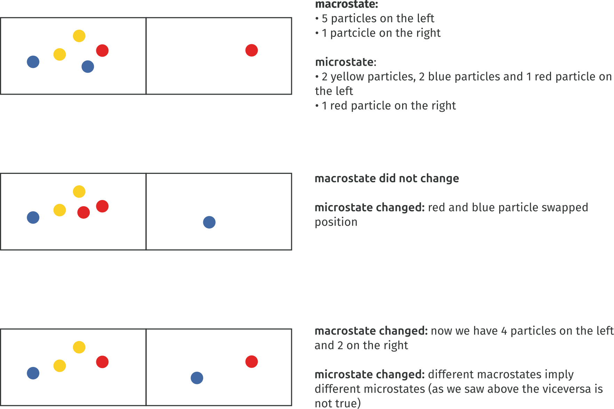
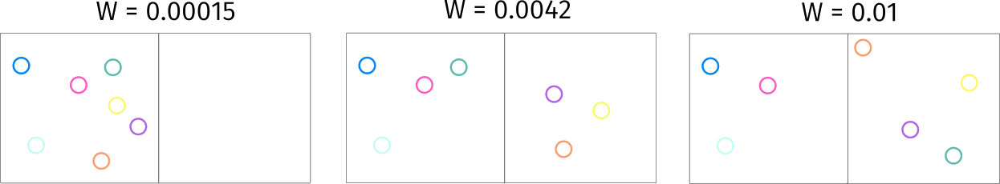
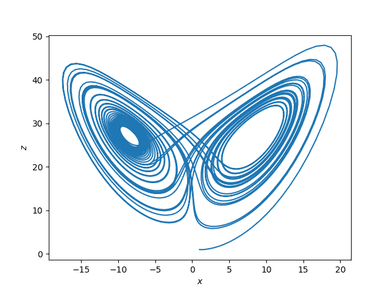

# Making sense of entropies
What’s a working definition of entropy we can use across multiple contexts?

The complexity stems from the vast number of definitions given formally and informally through time. We will start with the first definition and work our way through some of the more modern ones to get a sense of what we mean and what we definitely should not mean when talking about entropy.
<nav class="toc">
    <ul>
        <li><a href="#clausius">Clausius (1854): Classical Thermodynamics</a></li>
        <li><a href="#boltzmann">Boltzmann and Planck (1877–1901): Statistical Mechanics</a></li>
        <li><a href="#gibbs">Gibbs (1902): Statistical Mechanics Redux</a></li>
        <li><a href="#shannon">Shannon (1948): Information Theory</a></li>
        <li><a href="#renyi">Rényi Entropy (1961): Generalizing Information Measures</a></li>
        <li><a href="#kolmogorov">Kolmogorov–Sinai (1958): Dynamical Systems Theory</a></li>
    </ul>
</nav>

## Clausius (1854): Classical Thermodynamics {#clausius}

$$- \oint S_\text{env} = \oint \frac{\delta Q}{T_\text{env}} \leq 0$$
This is it, the first definition from thermodynamics (wanted to fit all in one equation, so I also added the Clausius inequality). Given some amount of heat $\delta Q$ leaving the environment sitting at $T_\text{env}$ and absorbed by a system, the cyclic integral must be less than or equal to 0. Now the question becomes, what’s a cyclic integral? The intuition is fairly simple: when equality holds, it means that the quantity $\frac{\delta Q}{T}$ absorbed by the system is equally compensated by the amount emitted from the environment. Also, if equality holds, I am moving all the heat (energy as heat) from the environment to the system without losing anything and creating a so-called reversible transformation. We call it reversible because **this integral is telling me that I can go back and forth exchanging heat all I want, and I won’t ever lose anything. This is, of course, impossible.**

Real transformations are irreversible, and this is what that inequality is saying. When you are moving heat from the environment to a system, trying to move it back, you will find yourself with less heat between your hands. This means that **entropy quantifies the non-idealities of a transformation** by describing how much heat I waste when moving it from one source to a destination due to real-world dissipation and friction.

The cyclic integral has another important implication: **entropy in reversible processes is a state function**. When we can show that a quantity does not change through a cyclic integral (equality holds), this means that taken two points $A$ and $B$ entropy can be quantified by looking only at the origin and destination state without taking into account the path from one to the other. This is important because **entropy can be used to qualify transformations from a higher level of abstraction**, disregarding how the transformation happened. On top of this, entropy can be easily computed for non-cyclic processes. Take a real transformation from $A$ to $B$ once we get to $B$ we have an irreversible transformation, but we also know that the entropy of a reversible transformation is 0. So, to compute the entropy of the real transformation from $A$ to $B$ it is sufficient to connect $B$ to $A$ with a reversible transformation which won’t affect our computation of the real entropy of the process. This way, we characterize the entropy of a transformation and not necessarily a cycle.

The realization that for every transformation we have an increase in entropy due to some non-idealities that lose some energy is very clear in **Planck’s statement of the second law of thermodynamics**:

> Every process occurring in nature proceeds in the sense in which the sum of the entropies of all bodies taking part in the process is increased. In the limit, i.e. for reversible processes, the sum of the entropies remains unchanged.
> <cite> [Planck (1903). Treatise on thermodynamics](https://archive.org/details/treatiseonthermo00planrich)</cite>

It is a complete equilibrium that guarantees fixed entropy; every time something changes I lose some energy in the process. This kind of statement may start to clarify why there exists **a link between entropy and time**. I know only a quantity that is guaranteed not to decrease with time; time itself. However, we have just established that entropy is another of such quantities, so we can say that both travel in the same direction, entropy points (like an arrow) in the same direction of time.

As we have seen, **entropy is neither disorder nor any other exotic concept (for now)**. In classical thermodynamics, entropy is “only” a way to quantify the amount of energy (as heat) we lose when we move it somewhere else.

## Boltzmann and Planck (1877 - 1901): statistical mechanics {#boltzmann}

$$S = k \log W$$

What? Where did the logarithm come from? Where did the integral go?

Let’s take a step back. Why did Boltzmann want a new definition of entropy in the first place? Wasn’t the one from before enough? No, it was not.

**Classical thermodynamics looks at macroscopic quantities while Boltzmann wanted to look at the microscopic**. Boltzmann was interested in the microscopic explanation of temperature, pressure, volume, and entropy. Statistical mechanics was born with the sole purpose of explaining everything that thermodynamics did, but starting from particles. Boltzmann set out to show that the second law of thermodynamics is a consequence of the collision between the particles of a gas.

Take a gas made of identical particles (a strong assumption, but bear with me), the state of such a gas can be fully specified by each particle’s position and momentum (product of mass and velocity), also called its microstate.

Now **coarse-graining** enters the stage. If you think of the microstate visually, you can superimpose a grid on it. That is, if the microstate were for a second comprised only of particles’ positions, you could put a grid on it and count how many particles are in each square of the grid. Take a look at the image below. We have a box of particles; their position in the box is the microstate. We decide that we are interested in which particles are to the right and to the left of the middle of the box; this is our macrostate. The particles are all equal, so we are only interested in counting how many are on each side. The macrostate with 4 particles on one side and 4 particles on the other can be realized in several ways, depending on which particle is on which side. This would not change the macrostate we are in, but would change the microstate, that is, which specific particle is on which side.

{width=90%, align="center"}

It turns out that the **macrostate is a rough approximation of the microstate**. Temperature, volume, and in general macroscopic properties do not care (in this simplified equal particles assumption) which particle is in which square.

Now we can finally define $W$ the argument of the logarithm. First, we describe the state of the gas through the distribution of particles, the count for each square of the number of particles:

$$D = (n_1, \dots, n_l)$$

Above, we assume $l$ squares and $n_i$ the number of particles in the i-th square. The distribution $D$ is **the complete depiction of the state of the gas**, coarse-grained but complete. Now we can finally define $W$
$$W = G(D) = \frac{n!}{n_1! \dots n_l!}$$

$W$ is **the number of arrangements compatible with a given distribution** $D$.

Here is where Boltzmann left off and Planck kept going. Boltzmann, throughout his career focused on **bridging thermodynamics and probability theory** because, as he states:

> For the molecules of the body are indeed so numerous, and their motion is so rapid, that we can perceive nothing more than average values. Hence, the problems of the mechanical theory of heat are also problems of probability theory.
> <cite>[Ludwig Boltzmann (1872). Further Studies on the Thermal Equilibrium
> of Gas Molecules](https://gilles.montambaux.com/files/histoire-physique/Boltzmann-1872-anglais.pdf)</cite>

This approach was rather avant-garde and weakly received by contemporary scientists. However, Planck, while working on black-body radiation (the radiation responsible for the red color of hot bodies), needed a fundamental explanation for the equation he developed by fitting experimental data. And there he realized:

> Since the entropy is an additive magnitude but the probability W is a multiplicative one, I simply postulated that S = k log W where k is a universal constant.
> <cite>[Max Planck (1901). On the Law of Distribution of Energy in the Normal Spectrum](https://web.archive.org/web/20140727104625/http://axion.physics.ubc.ca/200-06/Planck-1901.html)</cite>

The algebraic trick is pretty straightforward. If we have two systems with $W_1$ and $W_2$ number of arrangements, then if we merge the two systems, the number of arrangements becomes $W_1 \times W_2$. Think two dices with 6 outcomes, these two dices have 6\*6=36 possible outcomes. This is not ok for entropy, if two systems have entropy $S_1$ and $S_2$ the resulting entropy should be ${latex.inlineS_1 + S_2. It turns out that $\log(S_1S_2) = \log(S_1) + \log(S_2)$ and so the logarithm was the perfect candidate to keep entropy an ‘additive magnitude.’

**Boltzmann’s constant** (actually created by Planck) is the last piece of the puzzle. The problem here is that the original formulation of entropy from thermodynamics is measured as $J/K$ (Joule over Kelvin), it being a measure of the relationship between heat exchange (Joule) at a given temperature (Kelvin). So Planck introduced $k$ as:

$$k = \frac{R}{N_a}$$

where $R$ is the **molar gas constant** governing the ideal gas law:

$$pV = nRT$$

The product of pressure $p$ and volume $V$ is proportional to the product of amount of substance $n$ and absolute temperature $T$ through the constant $R$. $N_a$ is the **Avogadro constant** that represents the ratio between the amount of substance and the number of particles that it contains. So $k$ was constructed as the **proportionality factor that relates thermal energy of particles in a gas with the temperature of such gas**.

Summing up, Boltzmann and Planck wrote a definition of entropy that is a measure of how much we can infer about the arrangement of a system on the basis of its distribution. The original definition of entropy can be derived from this one, assuming an ideal gas (non-interacting particles).

The leap from the first definition of entropy is abysmal.

Probabilities and information enter the picture. We now quantify entropy given how much we do not know of the inner working of a system, given its outer properties. What’s inner and outer? It depends on what we are interested in. Perspective counts. **Entropy depends on what the observer wants to know about the system and what she already knows**. If ‘observer’ rings some quantum bells, that’s no surprise. Planck identified energy quantization (the existence of a smallest unit of energy that can be transferred or exchanged) as a prerequisite for this entropy definition so creating the whole field of quantum physics.

Entropy increase is now linked to uniformity:

Here, the macrostate counts how many particles are on the right and how many on the left. In the low entropy case, there is just one compatible arrangement for a full count on the right, all particles on that side. In the second case, the number of possible arrangements compatible grows as the number of particles on the left grows because we can count the possible compatible arrangements as:

$$W = \frac{n_\text{particles}}{n_\text{right}!n_\text{left}!}$$

Finally, this count has its maximum when $n_\text{right} = n_\text{left}$. Now, one very important consideration. Some say that in this picture disorder grows from right to left. It does not seem so obvious to me. I would rather say that the middle picture appears more disordered. Disorder is not really a formally defined term but rather a personal perception on the state of things, **using disorder when talking about entropy can be highly misleading**. In this case, and that’s the norm, we can clearly see that the last state reached is an equilibrium one in which the entropy is maximized and nothing more can happen.

So **entropy has a maximum**? Maybe, from this construction, it seems rather obvious that as thermodynamic processes march along, they tend to move towards the microstate that maximizes the number of arrangements with respect to the macrostate. This tendency is simply derived from the fact that these microstates outnumber  all the others and so assuming random movement, there will be convergence there sooner or later. Extending this idea to the whole universe we introduce **Heat death**. This hypothesis states that the universe will reach maximum entropy, and a state of complete equilibrium will cease all thermodynamic processes.

As we have seen, the Boltzmann-Planck formulation introduces:

- **probabilities**: processes become statistical, probability theory is the new language of entropy

- **information**: entropy quantifies how much knowledge we can infer about a system, heat is out of the picture

- **observer**: coarse-graining implies that an observer may choose any macrostate given what she knows about the system and what she wants to know

The entropy picture changed drastically, broadening the applicability of the concept and increasing the potential pitfalls.

Boltzmann derived many formulations for entropy, following several different paths. Here we summarized the most famous one. Throughout this article, we always take into account entropy formulations that have the highest chance of being mentioned in the general discourse.

## Gibbs (1902): Statistical Mechanics Redux {#gibbs}

$$S = -k \int_{X_\gamma} \rho(x_\gamma, t) \log [\rho(x_\gamma, t)] dx_\gamma$$

Here things start to get a bit notation heavy but conceptually we are not moving that far, I promise.
Earlier we said **probability is the new language of entropy** but no probabilities were on sight, here probability densities $\rho$ take center stage.

Gibbs set out to change the object of study of entropy from an individual system to an ensemble. Also said, we are moving from a theory of gases to a theory of systems. The ensemble is an uncountably infinite collection of independent systems that are all governed by the same equations but whose state at time $t$ differ.

$X_\gamma$ is the $\gamma$-space of the ensemble, also called the phase-space or the space of all possible microstates of the system. $x_\gamma \in X_\gamma$ is the vector of positions and momenta of all the systems (e.g. particles), the **actual microstate** of the system. $\rho(x_\gamma, t)$ is a probability density (more on $\rho$ interpretation in a second) reflecting the probability at time $t$ of finding the state of one of the systems in region $R \subseteq X_\gamma$ so that we can define:
$$p(R) = \int_R \rho(x_\gamma, t)dx_\gamma$$
Then, Gibbs started analyzing to get extensivity when combining probabilities $\log⁡(P_1 \cdot P_2)=\log(P_1)+\log(P_2)$. In particular, he wanted to derive a property of the whole ensemble so he started studying the average value of over all systems. In general we can write an average as:
$$\int_{\text{all space}} f(x) \rho(x)dx$$
If we take $f(\cdot) = \eta(\cdot) = \log(\rho(\cdot))$ then we define the average value of $\eta$ over the entire phase space, that is over the combination of all possible states of all systems as:
$$\bar{\eta}(x_\gamma, t) := \int_{X_\gamma} \rho(x_\gamma, t) \log[(x_\gamma, t)] dx_\gamma$$
At this point he was able to show that this quantity played the same role as **negative entropy** in the fundamental thermodynamic relation:
$$dU = TdS - PdV$$
where internal energy $U$ variation is expressed as a function of entropy $S$ and volume $V$ variations. So now it was straightforward to derive an entropy definition negating $\bar{\eta}$ and fixing the measurement unit by scaling for the Boltzmann-Planck constant $k$
$$S := -k \bar{\eta}(x_\gamma, t) = -k \int_{X_\gamma} \rho(x_\gamma, t)\log[\rho(x_\gamma, t)]dx_\gamma$$

It is important to note that this definition cannot be used to describe an approach to equilibrium in terms of entropy increase due to the Hamiltonian System assumption (underlying everything we said about Gibbs entropy) and Liouville’s Theorem.

Gibbs proposed the previous definition of entropy in ‘Elementary Principles of Statistical Mechanics’ where towards the end he identified a solution to the equilibrium problem: **coarse-graining**. In this formalism the idea is to take a partition $\omega$ of $X_\gamma$ where we get a set of cells $\omega_i$ of equal volume $\delta \omega$. The idea here is exactly the same of the grid but we are reasoning about the **continuous case**. We define the coarse-grained density as:
$$\bar{\rho}_\omega(x_\gamma, t) := \frac{1}{\delta \omega} \int_{\omega(x_\gamma)} \rho(x'_\gamma, t)dx'_\gamma$$
where $\omega(x_\gamma)$ is the cell in which $x_\gamma$ lies. From this the coarse-grained Gibbs entropy follows:
$$S_{\text{CG}} = -k \int_{X_\gamma} \bar{\rho}_\omega \log(\bar{\rho}_\gamma)dx_\gamma$$
One can prove that $S_\text{CG} \geq S$ for Gibbs entropies and so in principle these solves the equilibrium problem (maybe, not much consensus here).

We have now definitely moved to **the world of probabilities**. Jaynes’s interpreted $\rho(x_\gamma, t)$ as our lack of knowlege about a microstate of a system given its macro condition. **Entropy becomes a measure of how much knowledge we lack**. Again, knowledge, perspective, and stochasticity. This entropy definition consolidated all those concepts that were already imbued in Boltzmann’s definition through a more explicit and general formalization.

We have talked so much about knowledge that is now time to focus on information.

## Shannon (1948): information theory {#shannon}

$$S = - \sum_{x \in X} p(x) \log p(x)$$
Ok, this is surprisingly similar to Gibbs’. We move from densities to discrete probabilities but this is to be expected when moving from the continuous to the discrete. This looks very much like a discretization of the previous one without the Boltzmann constant. So, what’s the role of this definition almost 50 years after the ones from Gibbs and Planck? Formalizing a theory of communication for noisy channels and compression.

Shannon was thinking about this **problem**: there is a source $S$ producing messages which are communicated to a receiver $R$ registering them. Messages are discrete and sent by the source one after the other belonging to a set $m = \{m_1, \dots, m_n\}$. The goal was to **characterize the amount of information gained from the receipt of a message** as a function which depends on how likely the message are.

What does ‘measuring information mean’? It means mapping a probability distribution $P$ to a real value, the information content.
$$S(P): X \rightarrow R$$
$X$ is the set containing the probability distributions over the messages specified as:
$$P = (p(m_1), \dots, p(m_n)) \in X$$
**Given some messages and their probability we can sum the log probabilities weighted by their probability and get a measure of the number of bits needed to communicate them over an information channel**. Take 2 fair coins, in this case with equal probability the outcome can be heads or tail so $- (0.5 \log(0.5) + 0.5 \log(0.5)) \cdot 2 = 2$ (with log in base 2). If the coins were weighted with heads coming 90% of the times we would have $-(0.9 \log(0.9) + 0.1 \log(0.1))\cdot 2 = 0.94$. Why does a uniformly distributed process takes more bits to be communicated? The intuition is that, a nonuniform coin always admits some tricks (compression we would say). In this case we use 1 bit to say whether both coins output was head, and this would happen very often 0.9\*0.9=0.81=81% of the times. In the other cases we would fallback to using two bits to encode the outcome of both coins. Being this a probabilistic measure we can go lower than 1 bit, in a real communication this is obviously not possible but an interesting theoretical result to create efficient compression strategies.

If this is a measure of information content, why is this called entropy? Von Neumann is the culprit:

> You should call it entropy, for two reasons. In the first place your uncertainty function has been used in statistical mechanics under that name, so it already has a name. In the second place, and more important, no one really knows what entropy really is, so in a debate you will always have the advantage.
> <cite>[McIrvine, Edward C. and Tribus, Myron (1971). Energy and Information Scientific American 225](https://www.esalq.usp.br/lepse/imgs/conteudo_thumb/Energy-and-Information.pdf)</cite>

Von Neumann, who at the time was working on entropy himself, observed that Shannon’s formulation is very similar to already existing formulations in statistical mechanics. Discrete versions of Gibbs entropy and probabilistic versions of Boltzmann entropy had already been discussed in statistical mechanics by 1948.

Tables have turned again, **entropy can now be used to characterize any (discrete) stochastic process**. Later works also extended Shannon entropy to the continuous case, as in the case of Renyi which was able to derive the continuous case reaching a formulation equal to Gibbs’ except for the multiplicative constant.

**Entropy lost its measurement units** definitely escaping the thermodynamics world so characterizing processes of any kind. The discrete case does not even need coarse-graining, even if this is more related to the discrete nature of the process rather than a theoretical evolution, in the continuous case we would still need to deal with coarse graining.

The real revolution of Shannon formulation is **linking thermodynamics and information**. This led Jaynes (1957) to reconceptualize statistical mechanics through the lens of information theory. His work culminated in the **maximum entropy principle**:

> the probability distribution which best represents the current state of knowledge about a system is the one with largest entropy, in the context of precisely stated prior data
> <cite>[E.T. Jaynes (1957). Information Theory and Statistical Mechanics](https://bayes.wustl.edu/etj/articles/theory.1.pdf)</cite>

Also said, we should always choose the distribution that is maximally noncommittal with respect to the missing information because by not doing so we would make assertions for which we have no evidence.

After Shannon’s work we are able to apply entropy to almost any process. The interpretation is the same we have given for Gibbs’ entropy. **Entropy remains a measure of what we do not know about a system given what we know and what we want to know**. We are still talking about uncertainty, perspective, and stochasticity. The maximum entropy distribution is the uniform, which I would not call the most disordered distribution of all. So still, talking about disorder seems at best misleading at worst completely wrong. Uncertainty on the other hand keeps being the best overarching interpretation we can give, sidestepping Clausius’ definition where uncertainty does not play any role and instead we would be better talking about non-idealities.

Information theory is a very generally applicable field and so Shannon’s definition not only built a bridge to statistical mechanics but it also gave rise to many new entropy definitions which can be to different degrees matched to Shannon’s.

## Renyi Entropy (1961): Generalizing Information Measures {#renyi}

$$S_\alpha := \frac{1}{1-\alpha}\log(\sum_{i=1}^n p_i^\alpha)$$
We are not moving that far from the previous definition (yet). **Renyi set out to generalize Shannon’s definition keeping entropy additive for independent event** (hence the logarithm).

Taking the limit $\alpha \rightarrow 1$ we get **Shannon’s entropy**:
$$S_1 = - \sum_{i=1}^n p_i \log p_i$$
Taking the limit $\alpha \rightarrow 0$ is more subtle. As $\alpha$ approaches 0 Renyi entropy increasingly weighs all events with nonzero probability more equally regardless of their probabilities. We get **Hartley or max-entropy** which simply counts the number of possibilities completely ignoring the distribution:
$$S_0 = \log n$$
We can now get **Collision/Renyi entropy** for $\alpha=2$. This entropy is called collision entropy because it can be interpreted as the **negative logarithm of the probability that two independent random variables, both described by p, will take the same value**.:
$$S_2 = -\log\sum_{i=1}^n p^2_i$$
Sample twice from the same random variable and in both case you get an outcome with probability $p$, this event has a probability $p^2$ of occurring. This is why we can interpret it as a collision.

As we go towards infinity the entropy is increasingly determined by the events of highest probability. In the limit $\alpha \rightarrow \infty$ the Renyi entropy converges to **min-entropy**. This is the most conservative way of measuring the unpredictability of a set of outcomes, **the negative logarithm of the probability of the most likely outcome**. It is the smallest entropy measure in the family of Renyi entropies:
$$S_\infty =- \log \max_i p_i$$
This entropy has numerous application in all those cases in which we need a strong guarantee on the information content of a discrete random variable.

Obviously, Renyi entropy can also be employed at different $\alpha$ levels than the ones I showed here. The idea stays the same, take Shannon’s definition and bend it to accomodate different use cases.

## Kolmogorov-Sinai (1958): Dynamical Systems Theory {#kolmogorov}

$$S := \sup_\alpha\{\lim_{n \rightarrow \infty}H_n(\alpha, T)\}$$

Where did everyone go? Nowhere, but we must thoroughly dissect this formulation to map it back to Shannon’s.

Let’s build $H_n(\alpha, T)$ piece by piece. The first ingredient we need is

$$H(\alpha) := - \sum_{i=1}^k \mu(\alpha_i)\log(\mu(\alpha_i))$$
Warning, this notation is not very clear but $H(\alpha)$ and $H(\alpha, T)$ have different definitions. Those still alive at this point will notice that this definition resembles Shannon’s but we have to make sense of $\mu$ and $\alpha$.

Take a set of possible system states $x \in X$ this is the phase space of the system. Take now a family of deterministic transformations $T_t: X \rightarrow X$ mapping the phase space to itself with $t$ being the time. Think a cart on a rail which given some initial position and velocity is left free to run around.

This entropy definition takes into account **volume preserving dynamical systems** which are (loosely speaking) systems that admit a metric $\mu$ over the phase space which is preserved through system evolution. We take into account all the systems whose state space admits some definition of a distance so we can measure lengths, areas, volumes, and these measurements do not get distorted through transformation (many systems fit in this category). Ok then, what’s the connection between this and what we were discussing earlier? **Probabilities**.
The measures $\mu$ we are talking about are normalized to sum to one so that we can apply probability theory to them. To get back to the cart again, we know that this cart may be in any position along the rail and could have any speed at each position. The measure $\mu$ we are talking about is reasoning about joint intervals of position and velocities to understand how much of the whole cart phase space they occupy. Also said, how likely it is for the cart to be in a given position with a given velocity. ‘Likely’ is the keyword here. The probability of an event $E$ is the fraction of time the system spends in the region of $X$ associated with $E$ (assuming the system is ergodic).
**The observer chooses the event she wants to monitor (the macrostate) the microstate evolves according to some underlying transformation and we build a measure of how likely it is for the system to produce the event we are interested in**.
To the cart again. Let’s add a sensor on top of the rail which triggers every time the cart passes in front of it with a speed lower than a given limit. The event $E$ is the sensor triggering. The region of the space $X$ is the subspace with the positions in front of the sensors joined with the admissible speeds. $\mu$ is the area of the rectangle built joining the two intervals, position along the rail and cart speed, and then divided (i.e. normalized) for the area of the rectangle made of total speed range and total rail length. So this is $\mu$, a probability in disguise but with a more flexible interpretation.

Let’s focus on $\alpha$ now.
$\alpha$ is a partition of our measure preserving system. A partition is some kind of subdivision of our phase space that covers the whole space and does not have any overlap (e.g. a grid superimposed on our space where the cells are not necessarily all equal). Sounds familiar? coarse-graining! But that’s not all, $\alpha$ **makes encoding explicit**.

As we have discussed earlier, in Shannon’s equation the number of bits takes into account the best encoding possible, like in the weighted coin case. When the distribution is not uniform there is always some clever encoding that allows me to reduce the number of bits with respect to the maximum I would need to communicate the uniform case. This kind of considerations become explicit through the encoding $\alpha$⁡. **We relate partitions and encodings through messages**. Every time the trajectory passes through the i-th ‘cell’ of the partition we save a message $m_i$ registering so to build a description of the trajectory not through the phase space but through the ‘partition-space’. Take the cart again (I promise it’s almost over), partitioning its phase space would equal to partitioning the rail in sections and creating speed intervals. We would produce a message $m_i$ every time the cart passes through a given rail section with a speed in a given speed interval.

Sticking $\mu$ and $\alpha$ together we can now say that $\mu(\alpha_i)$ is the measure of the subset $\alpha_i$ such that $\alpha = \{\alpha_1 \dots \alpha_n\}$ is a partition of the phase space of the system. Also said, $H(\alpha)$ is the entropy of a given partition of the system, a measure of how uniform the partition is over the system phase space.
Now let’s define $H_n$:
$$H_n(\alpha, T) := \frac{1}{n}H(\alpha \lor T^{-1} \alpha \lor \dots \lor T^{-n +1}\alpha)$$
The idea here is measuring the entropy of the partition through time. Here we get $H$ as before but applied to the partition $\alpha$ joined with the partition $\alpha$ but taken one step back in time (that’s $T^{-1}$) and so on. Also said, **H_n measures the average amount of information which the system produces per step over the first n steps relative to a coding alpha**. We now define $H(\alpha, T)$:
$$H(\alpha, T) := \lim_{n \rightarrow \infty} H_n(\alpha,T)$$
That is **the average amount of information produced by the system per step relative to a coding alpha**.
Finally, we get to
$$\sup_\alpha\{H(\alpha, T)\}$$
which **measures the highest average amount of information that the system can produce per step relative to an encoding**.

Entropy is now alive. This result is relevant because we now talk about information/entropy production through time. That’s the first definition we encounter in which system evolution is so apparent. Maybe Clausius original definition would be the closer in this regard with the integral representing an actual transformation through time.

**A positive KS entropy is often linked to chaos**. Shannon information measures uncertainty and uncertainty is a form of unpredictability. A positive KS entropy means that the behaviour of the system is unpredictable. Disorder takes the stage again. I have been going on and on about disorder not being representative of any entropy definition and now a link to chaos.

{width=70%}
Does this seem disordered? I would not say so, maybe someone would. It is important to note that **chaos can be summarized through Lorenz words** as:

> When the present determines the future but the approximate present does not approximately determine the future.
> <cite> [Lorenz, The Essence of Chaos (1993)](https://eclass.uoa.gr/modules/document/file.php/PHYS289/%CE%92%CE%B9%CE%B2%CE%BB%CE%AF%CE%B1/Edward%20N.%20Lorenz%20-%20The%20Essence%20of%20Chaos-CRC%20%282005%29.pdf)</cite>

Which is not necessarily a definition of disorder.

Aside from this nitpick, we made a spectacular leap. Sinai and Kolmogorov through their work connected information theory and dynamical systems theory. We now have an entropy definition to quantify entropy production rate, that is the behavior of a whole system. Until now we have been characterizing states while now we have a new layer of abstraction on top, systems can now have an entropy regardless of their initial state.

## Conclusions

From Clausius all the way to Kolmogorov. We started with a definition of entropy that would not accommodate much of what we frequently say when talking about entropy. Then we found the culprit, after Boltzmann work entropy becomes a quantification of uncertainty for a given observer with a given interest in the system under scrutiny. Then, Gibbs paved the way and Shannon freed entropy from thermodynamics to make it a universal quantity. Renyi generalized Shannon’s work retaining the theoretical framework but greatly increasing the applicability. Finally, Kolmogorov and Sinai extended entropy to dynamical systems theory moving from a fixed value to entropy production rate useful for directing entropy to systems rather than transformations.

Through Boltzmann lens the most actionable definition of entropy si **entropy as uncertainty**: how much we do not know about a system given what we already know and what we want to know. Entropy is linked to the observer and the interest she has in the system under scrutiny. Stochasticity introduces uncertainty about a system and we can use entropy to quantify how hard is to get more information to fill the knowledge gaps we have.

Much more work has been done on entropy in quantum physics and cosmology for example. I think that these works have not yet entered the pop discourse (maybe for the lack of consensus) so I decided not to take them into account.
