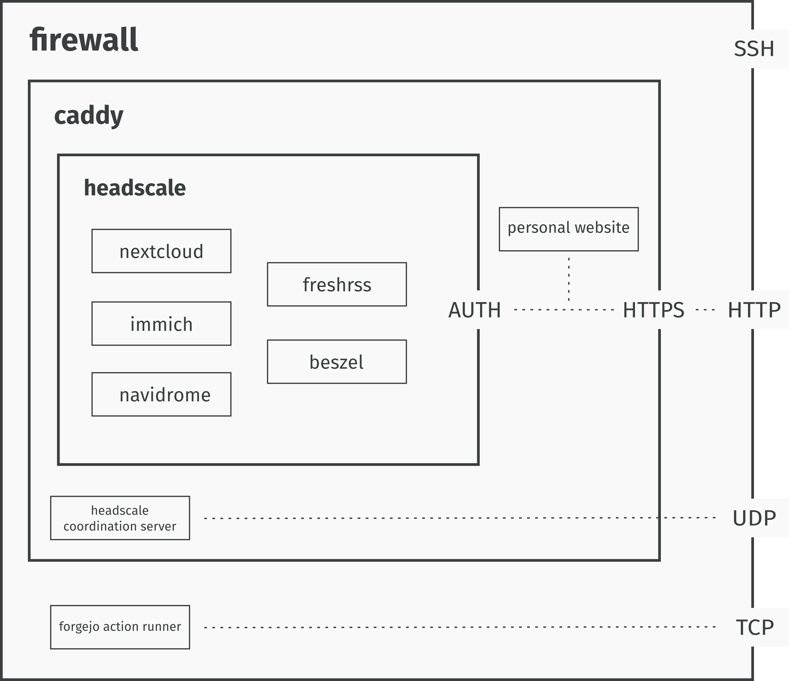

# From Big to Accurate Tech: My Self Hosted Setup

## The Mission {#the-mission}

Replacing big tech platforms and subscriptions with self hosted solutions:

- Google Drive and calendar -> [Nextcloud](https://nextcloud.com/)
- Google Photos -> [Immich](https://immich.app/)
- Spotify -> [Navidrome](https://www.navidrome.org/)
- Github -> [Codeberg](https://codeberg.org/)
- Gmail -> [Mailbox](https://mailbox.org/en/)
- Hacker News -> [Freshrss](https://www.freshrss.org/)
- Tailscale -> [Headscale](https://headscale.net/stable/)
- (bonus track) scattered note taking -> [Silverbullet](https://silverbullet.md/)

I built the system myself but you can get there in an afternoon with [Yunohost](https://yunohost.org/). Yunohost provides a way to self-host a wide array of apps through a unified interface. I chose not to use it as I wanted to experiment and learn myself how to do it.

All this lives on a Hetzner's CX33 with a 100GB SSD volume (~10 euro/month) with a fully open-source implementation.

I decided not to self host emails as it gets tricky not to get your emails flagged as spam. Instead, I subscribed to a standard plan at [mailbox.org](https://mailbox.org/en/) and use this website's domain as a custom domain for my email (~ 3 euro/month).
<nav class="toc">
    <ul>
        <li><a href="#the-tools">Tools: what services I deployed</a></li>
        <li><a href="#the-execution">Execution: how I deployed them</a>
        <ul>
           <li><a href="#caddy-setup">Caddy Setup: reverse-proxy configuration</a></li>
           <li><a href="#headscale-setup">Headscale Setup: device authentication for remote access</a></li>
           <li><a href="#firewalld">Firewalld: keeping everything reasonably secure</a></li>
           <li><a href="#deployment">Deployment: putting it all together on a VPS</a></li>
        </ul></li>
        <li><a href="#the-conclusion">Conclusions</a></li>
    </ul>
</nav>

## Tools {#the-tools}

- **Nextcloud**: does not need many introductions, a self-hosted cloud service with far more features you will ever use. Used in production by individuals and companies alike. I use it for the sheer simplicity of installing it through the [all in one container](https://github.com/nextcloud/all-in-one). I do not have many requirements for a service like this, I use it for **documents and calendar syncing across devices**. All other features I don’t mind but there’s a ton.

- **Immich**: the standard in open-source image archiving. Actively predates Google Photos by providing intelligent search and (local) machine-learning features. Clean UX both for the browser and the mobile versions. Provides features to load all your library from the most popular services and to batch process your images from the CLI.

- **Navidrome**: Spotify is unbearable, it got so much worse I could not justify paying for it. I don't want a social media platform full of ads and a schizophrenic variety of media content, I just want to listen to the music I like. And don't get me started on artist retribution and [AI-weapons support](https://www.deedsmag.com/stories/what-spotifys-latest-controversy-reveals).
Navidrome just works, a simple music server without playback capabilities but all the music organization features you would expect from a modern service. This means, you will need dedicated clients for streaming your music library. [Tempo](https://github.com/CappielloAntonio/tempo) on mobile and [Supersonic](https://github.com/dweymouth/supersonic) on desktop work well for my purposes. [Symphonium](https://www.symfonium.app/) has many aficionados but I purposedly decided to avoid closed source implementations. If willing to host movies, books, and other multimedia content take a look at [Jellyfin](https://jellyfin.org/)

- **Codeberg + self-hosted Forgejo actions**: I won’t get in too much detail here as I will publish a more in-depth article on Git forges and git alternatives in a bit. [Codeberg](https://codeberg.org/) is a fully-fledged Github alternative that uses [Forgejo](https://forgejo.org/) under the hood as a git forge. Think of a git forge as a git server with added features such as pull-requests, project management, wikis, static website serving, and all the other features you expect from Github, GitLab, Gitea, and the like. I believe in the publish once syndicate everywhere strategy ([POSSE](https://indieweb.org/POSSE)), so I will run development on [my Codeberg account](https://codeberg.org/dpaletti/) and mirror almost everything on Github. I could host Forgejo myself but I like Codeberg and don't feel the need to add complexity to my deployment. Instead, I host my own Forgejo runners (Gitbub job runners equivalent) to overcome CI limitations while still supporting Codeberg.

- **Freshrss**: RSS is one of the most underrated internet technologies. Many websites provide RSS feeds: an updated registry of the content published on a given website. All these feeds get aggregated through apps such as Freshrss, an RSS feed aggregator that just works. Clean UI (that’s an acquired taste I fear) and high quality clients like [Capy Reader](https://capyreader.com/) on Android and the Freshrss web interface on desktop. Supports categories, feeds, and many RSS variations. Definitely the best way to stay updated across scattered blogs, newspapers, and news aggregators (finally ditched Hacker News for the better, maybe in a later article I will discuss some cool technology blogs and aggregators).

- **Silverbullet**: one of the services I use the most. [Silverbullet](https://silverbullet.md/) is a note-taking browser based application with progressive web apps for all platforms that actually works. I use it mainly from my laptop but I do minor edits from my mobile, works seamlessly. Great level of UX polish, astounding number of features, Lua extensibility and distraction-free editing experience. Offline-first app with great syncing strategies and conflict resolution, the absence of ad hoc apps greatly simplifies the design and allows for a coherent experience across devices and operating systems. This is the first time that I think a progressive web app (PWA) is the right tool for the job. Silverbullet got me off of [org-mode](https://orgmode.org/) which is definitley an achievement in my book.

- **Caddy**: along all the private services I am also serving this website. This is thanks to [Caddy](https://caddyserver.com/) which is a reverse-proxy that also handles certificate renewal so that this website and all other services are accessible through HTTPS. A reverse-proxy is just a way to have a unique entry point to all my services (we will see later how this is actually achieved) and then have my requests redirected to the correct service. Caddy is a tool that just works, there are many others, this works for me and I did not need to look much further. Through Caddy I am able to avoid Cloudflare while still keeping the website reasonably fast and secure.

- **Headscale**: self-hosted Tailscale. Tailscale is a mesh VPN but the coordination server it uses is not open-source, while the client is. The idea is to have a central door to which device registers for remote access. This way we can handle authentication seamlessly. That central door is the authentication server, and Headscale is an open-source implementation of such server. The Headscale repo is still basically in the hands of the Tailscale organization but this is the best I could do. I don't have many more ideas to easily manage device authentication. You will also need some clients and for that I am using the official Tailscale one which seems open-source (or code-available at least).

- **Beszel**: I needed something to monitor resource utilization and the state of all services, Beszel perfectly fits this need. Incredibly easy to install and with a polished web UI while providing: resource utilization, service state, and log for all services. I evaluated a combo of Graphana and Prometheus but I didn't want an overly complicated solution for my limited needs.

## Execution {#the-execution}

From now on I will talk about the deployment you can find in my [repo](https://codeberg.org/dpaletti/self-hosted-services).

The full deployment needs 3 files:

- `docker-compose.yaml`: contains all services as Docker containers and inlined configuration files for both Caddy and Headscale
- `firewalld_config.sh`: a firewall(d) configuration script to block all traffic except what’s strictly necessary
- `.env`: secrets and environment variables

Many self-hostable services have Docker compose files ready to go you can simply add to your global configuration. Networking and security are a bit less straightforward but all in all nothing esoteric. This is the high-level system diagram:

{width=90%, align="center"}

When a request arrives:

1. Firewall blocks everything that is not HTTP(S), SSH or specific TCP/UDP connections.
2. Caddy acts as a reverse proxy managing HTTPS, rate limiting and hiding network topology.
3. Then, the request gets filtered by Headscale that checks whether the device can access the required service.
4. If everything went well the service is accessible.

This kind of configuration allows for seamless access for authorized devices while keeping the server reasonably secure.

We will now take a more in-depth look at some of the services that make this flow possible. I kept everything inside a single compose file to avoid scattering and ease long term maintenance.

### Caddy Setup {#caddy-setup}

Caddy is the reverse-proxy that handles all traffic to the server, including the traffic to this website. I extended the official docker image with a plugin for rate limiting access to this blog:

```dockerfile
caddy:
  build:
    context: .
    dockerfile_inline: |
      FROM caddy:builder AS builder
      RUN xcaddy build \
          --with github.com/mholt/caddy-ratelimit

      FROM caddy:latest
      COPY --from=builder /usr/bin/caddy /usr/bin/caddy
  container_name: caddy
  restart: always
  volumes:
    - caddy_certs:/certs
    - caddy_config:/config
    - caddy_data:/data
    - caddy_sites:/srv
    - /root/blog:/blog
  network_mode: "host"
  configs:
  - source: Caddyfile
    target: /etc/caddy/Caddyfile
```

The idea here is using an inline Dockerfile to keep everything in one file, so much that also the Caddy config file is inside the same Docker compose file. In this section and all the following ones I will pick only the most relevant bits of the Docker compose file which is long (and boring) to be fully discussed in this article. Again, you find the full file in my [repo](https://codeberg.org/dpaletti/self-hosted-services).

Then, to actually serve the blog and rate limit it:

```dockerfile
configs:
  Caddyfile:
    content: |
  (rate_limit_blog) {
      rate_limit {
          zone blog {
              key {remote_ip}
              events 500
              window 1s
              burst 100
          }
      }
  }

  $DOMAIN {

      import rate_limit_blog
      root * /blog

      encode zstd gzip

      header {
          Strict-Transport-Security "max-age=31536000; includeSubDomains"
          X-XSS-Protection "1; mode=block"
          X-Frame-Options "DENY"
          Content-Security-Policy "default-src 'self'; style-src 'self' 'unsafe-inline'; script-src 'self'"
      }

      file_server
  }
```

Any other service you want to add which you want to serve just needs basic reverse-proxy configuration. In my case, I decided to use this domain as the basis of all my networking configuration. This means, you need DNS records set up at your domain registrar (I use [Porkbun](https://porkbun.com/) and I would recommend it) and then add to the caddy configuration something like:

```dockerfile
rss.$DOMAIN {
           reverse_proxy 127.0.0.1:8081
}
```

Above we assume that the Freshrss service container is akin to:

```dockerfile
  freshrss:
    image: freshrss/freshrss:latest
    container_name: freshrss
    hostname: freshrss
    restart: unless-stopped
    logging:
      options:
        max-size: 10m
    volumes:
      - rss_data:/var/www/FreshRSS/data
      - rss_extensions:/var/www/FreshRSS/extensions
    ports:
      - "127.0.0.1:8081:80"
```

Where the original port 80 gets mapped to 8081 so avoiding clash with other services which may use port 80 by default.

At this point, we have a working reverse proxy configuration but anyone can access `rss.dpaletti.com`. In general, we assume a login page at that point but I would prefer to keep these services private given that I am also archiving personal photos and notes. To achieve this, we deploy Headscale.

### Headscale {#headscale-setup}

The main goal here is having a way to securely connect to my services by recording device identities.

```dockerfile
headscale:
    image: headscale/headscale:latest
    container_name: headscale
    restart: unless-stopped
    command: serve
    configs:
      - source: headscale_config
        target: /etc/headscale/config.yaml
    volumes:
      # Use a named volume for the database and keys
      - headscale_data:/var/lib/headscale
      - headscale_run:/var/run/headscale
    dns:
      - 8.8.8.8
      - 1.1.1.1
    ports:
      - "127.0.0.1:8085:8080"
      - "127.0.0.1:9090:9090"
      - "3478:3478/udp"
    healthcheck:
      test: ["CMD", "headscale", "health"]
```

This is Headscale Docker compose configuration, almost everything copy pasted from the docs with slight adaptations:

1. Configs: I decided I wanted to inline Headscale config so to have everything in one file.
2. Labels and networks: this is Beszel specific config so that we can monitor resource utilization (you will find this attached to all services)
3. port mapping: avoid clash with other services

Now we want to route traffic from caddy through Tailscale. We need to slightly extend the caddy config file:

```dockerfile
(private) {
          @denied not remote_ip 100.64.0.0/10 fd7a:115c:a1e0::/48 127.0.0.1 ::1 2a01:4f8:1c1a:5a7b::1
          respond @denied "Access Denied: You are not on the private network." 403
      }
```

This rule checks whether the device is successfully logged into Tailscale, else it gets bounced. Last step is enforcing this rule for all traffic we want to filter, our Freshrss rule becomes:

```dockerfile
rss.$DOMAIN {
         import private
         reverse_proxy 127.0.0.1:8081
}
```

At this point, we need the Tailscale log-in flow to work. We expose the Headscale coordination server through Caddy and we configure it appropriately:

```dockerfile
 headscale.$DOMAIN {
   handle /web* {
       import private
       reverse_proxy 127.0.0.1:8086
  }
```

The trickiest part is the Headscale config:

```dockerfile
      server_url: https://headscale.dpaletti.com:443
      [... defaults skipped, find the whole config in the repo ...]
      dns:
        magic_dns: true

        base_domain: vpn.dpaletti.com

        override_local_dns: true

        nameservers:
          global:
            - 8.8.8.8
            - 1.1.1.1

          split: {}

        search_domains: []
        extra_records:
          - name: "rss.dpaletti.com"
            type: "A"
            value: "100.64.0.1"
          [... some more records ...]
          - name: "rss.dpaletti.com"
            type: "AAAA"
            value: "fd7a:115c:a1e0::1"
    [... some more defaults ...]
```

The most important section is noting that for every service I want to expose I need appropriate magic DNS records so that Headscale correctly routes to the requested service.

This embeds services on subdomains of the domain hosting my blog while keeping access only to desired devices without recurring to Tailscale closed source coordination server.

### Firewalld {#firewalld}

[Firewalld](https://firewalld.org/) is truly great and easy to use. The main idea is that changes get applied immediately in the runtime environment without service restart. I am not an expert on this, so I got a bare bones configuration blacklisting all connections and selectively allowing only the ones I needed. On top of that, I enabled masquerading (network address translation) to allow Freshrss to download the feeds. This is all my configuration which I keep in a `.sh` file applied by simpling running it in a shell:

```sh
echo "==> Enabling firewalld"
systemctl enable --now firewalld

echo "==> Reload (clean slate)"
firewall-cmd --reload

echo "==> Setting default zone to public"
firewall-cmd --set-default-zone=public

echo "==> Enabling Masquerading (Required for container outbound traffic)"
firewall-cmd --permanent --zone=public --add-masquerade

echo "==> Explicitly allowing essential public services"
firewall-cmd --permanent --zone=public --add-service=ssh
firewall-cmd --permanent --zone=public --add-service=http
firewall-cmd --permanent --zone=public --add-service=https
firewall-cmd --permanent --zone=public --add-port=3478/udp

echo "==> Reloading firewall rules"
firewall-cmd --reload
```

The main idea is setting the default zone to public so that all connections get blocked by default. Then, add essential connections to the public zone to allow them. A simple setup, again, I am not good at this stuff.

### Deployment {#deployment}

All this gets deployed to my VPS through a Forgejo action triggered on a main-branch push to my repo. Forgejo actions are Github action compatible so it's pretty straightforward to write one, you can find the full implementation [in the repo](https://codeberg.org/dpaletti/self-hosted-services/src/branch/main/.forgejo/workflows/deploy.yaml).
First we check out current changes, then we retrieve secrets (much like Github) and paste them in the `.env` file:

```yaml
    steps:
      - name: Checkout repository
        uses: https://github.com/actions/checkout@v6

      - name: Update .env file with secrets
        run: |
          sed -i "s|SILVERBULLET_USER=.*|SILVERBULLET_USER=${{ secrets.SILVERBULLET_USER }}|g" synced/.env
          sed -i "s|SILVERBULLET_PSW=.*|SILVERBULLET_PSW=${{ secrets.SILVERBULLET_PSW }}|g" synced/.env
          sed -i "s|BESZEL_TOKEN=.*|BESZEL_TOKEN=${{ secrets.BESZEL_TOKEN }}|g" synced/.env
          sed -i "s|BESZEL_KEY=.*|BESZEL_KEY=${{ secrets.BESZEL_KEY }}|g" synced/.env
```

At this point, we sync everything to the VPS through `rsync`, this is a good example of using a Github action inside a Forgejo action:

```yaml
      - name: Sync to VPS
        uses: https://github.com/burnett01/rsync-deployments@v8
        with:
          switches: -avzr
          path: synced/
          remote_path: ${{ secrets.VPS_SETUP_REMOTE_PATH }}
          remote_host: ${{ secrets.VPS_SSH_HOST }}
          remote_port: 22
          remote_user: ${{ secrets.VPS_SSH_USER }}
          remote_key: ${{ secrets.VPS_SSH_PRIVATE_KEY }}
```

Finally we apply firewall and Docker config using SSH keys we are keeping as secrets:

```yaml
      - name: Execute deployment commands
        uses: https://github.com/appleboy/ssh-action@v1
        with:
          host: ${{ secrets.VPS_SSH_HOST }}
          port: 22
          username: ${{ secrets.VPS_SSH_USER }}
          key: ${{ secrets.VPS_SSH_PRIVATE_KEY }}
          script: |
            chmod +x firewalld_config.sh
            ./firewalld_config.sh
            docker compose up -d
```

## Conclusions {#the-conclusion}

I felt that I was spending too much time on platforms (which I was paying for) without getting much in return. User engagement optimization strategies began to feel unbearable. I don't want to waste time on these services while feeling incapable of logging out whenever I want.

Along these lines, I have also opened a [Mastodon profile](https://social.coop/@dpaletti) which helps me discover interesting people and discussions without (at least for now) addictive mechanisms. I could self-host my own Mastodon instance but for now I am on [social.coop](https://social.coop) and I don't feel the need to. Keeping an instance updated is a greate deal of work and I think it does not make much sense for the time being. Maybe in a later article I will talk about how to stay on top of news, tech, science, culture, and whatnot without mainstream social media.

All that said, if you want the benefit without the hassle checkout [Yunohost](https://yunohost.org/), all the services I talked about and many more are available for installation with a prebuilt solution you can host on a (rather performant) toaster.
